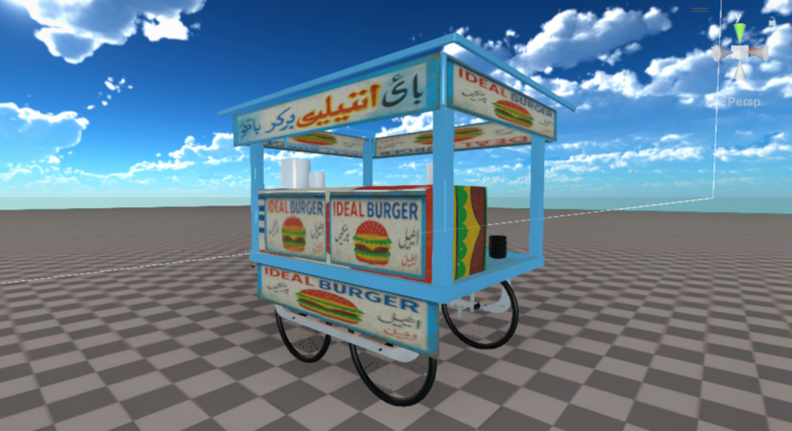

<!-- 🚀 Ultimate 3D Repo by Munib Jahangir 🚀 -->

<h1 align="center">
  🇵🇰 ThelaVerse 3D — Pakistan's Street Food Legends in 3D 🛻
</h1>

  

---

### 🧠 **Project Overview**

> “From Karachi to Lahore — every street has a story.  
> ThelaVerse 3D turns those stories into art.”

A breathtaking 3D showcase of Pakistani street culture recreated with cinematic precision.  
From the smoky burger stalls to the colorful gola ganda counters — this is realism powered by nostalgia and Blender.

---

### 🍔 **Included Models**

| Model Name | Description |
|-------------|--------------|
| **🍔 Burger Wala** | The ultimate midnight hunger savior — detailed grill, buns, and neon cart lighting. |
| **🍧 Choti Dukan Metha Zaiqa** | Pure nostalgia — sweet syrups, crushed ice and color chaos recreated in 3D. |
| **🍧 Marhaba Uncle Gola** | Karachi’s iconic gola setup, complete with bottles and summer vibes. |

---

### 🖼️ **3D Screenshots**

  
  
  

---

### 🧱 **Made With**
| Tool | Purpose |
|------|----------|
| 🧊 **Blender** | 3D Modeling & Sculpting |
| 🌈 **Substance Painter** | Realistic Texturing |
| ⚙️ **Unity Ready** | For Game & Cinematic Integration |

---

### 🔥 **Why This Repo Exists**

> “If the world can 3D model Cyberpunk Tokyo,  
> then Pakistan deserves its ThelaVerse.”

This project by **Munib Jahangir** brings *Pakistani street flavor* into the 3D universe —  
a fusion of culture, creativity, and technical art.

---

### 🎮 **Use Cases**
- Pakistani-themed open-world & story games  
- Street-based cinematic shots  
- VR/AR cultural experiences  
- Game jam & indie showcases  

---

### 💎 **Future Plans**
- ☕ Karachi Chai Dhaaba (with steam & cups animation)  
- 🍗 BBQ Stall with smoke particles  
- 🚚 Music Van for festival street scenes  
- 🌆 Full "Pak Street" Environment Pack  

---

### 🧑‍🎨 **About the Creator**

**🎮 Munib Jahangir** — Game Developer • 3D Artist • Founder of **PakNova Games**

> “From desi streets to futuristic cities — my goal is to make Pakistan playable.”

🌐 [PakNova Games Studio](#)  
🎮 [SkyFire Racer](#) | [Dead Horizon 2](#) | [Aurora Initiative](#) | [Pak Thunder Racing](#)

---

  
  
  

---

<h3 align="center">
  ⭐ Star this repo if you’ve ever had a street burger or gola ganda in real life!  
  Let’s make Pakistani 3D culture global 🌍🔥
</h3>
